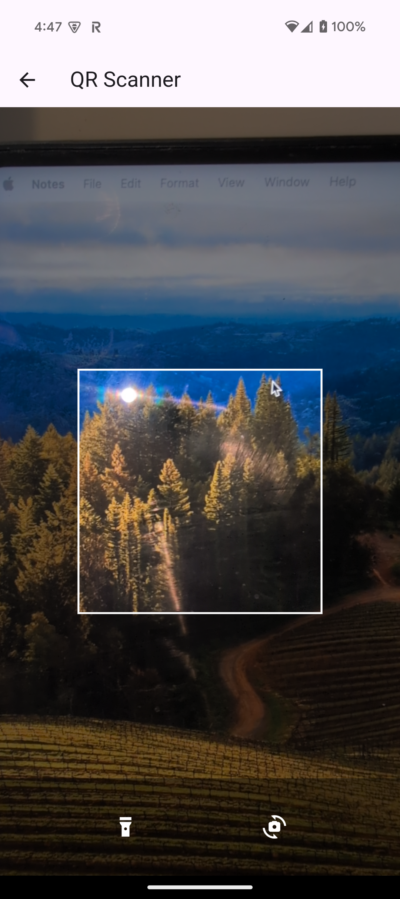
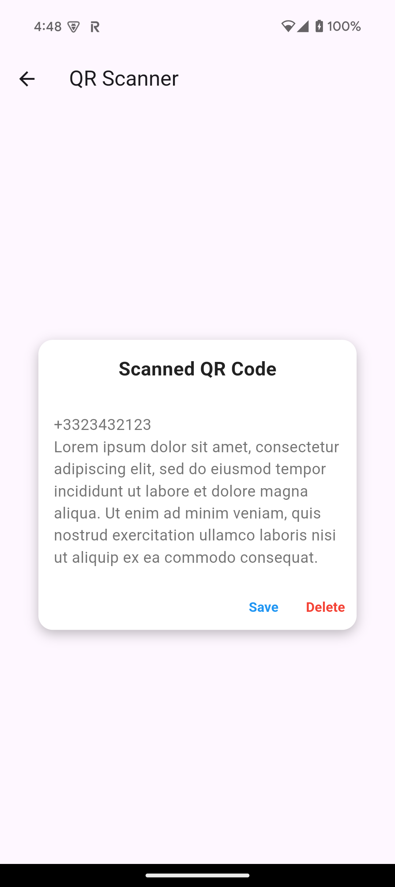
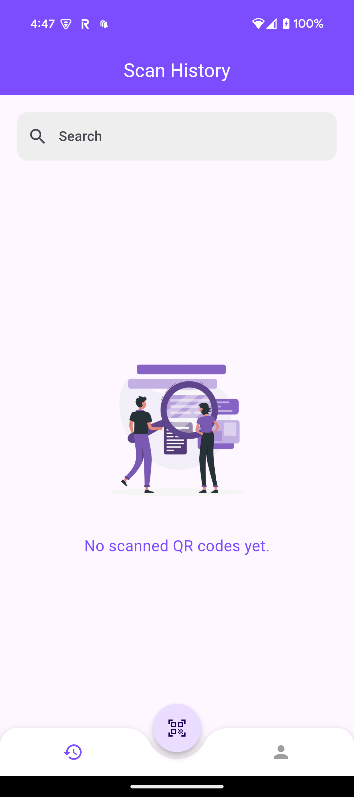
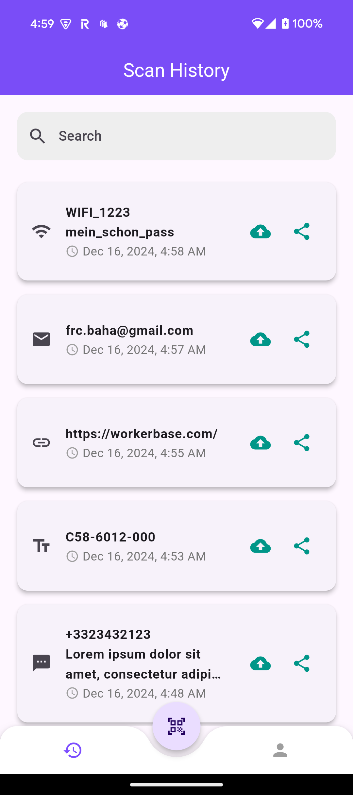
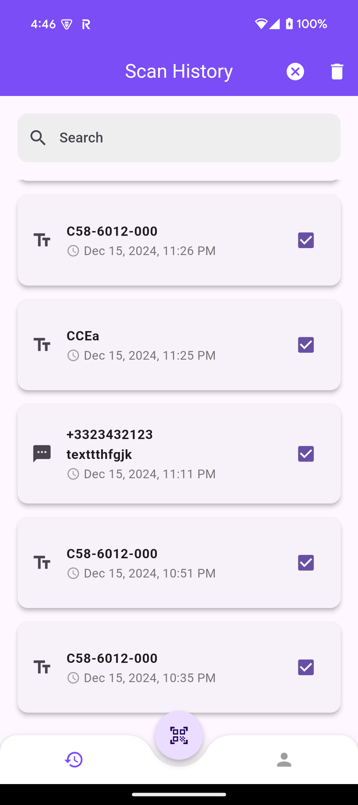
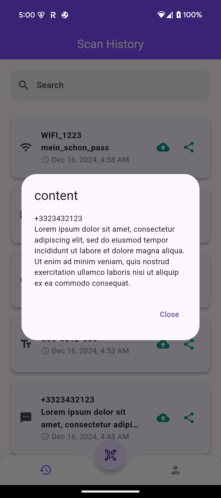
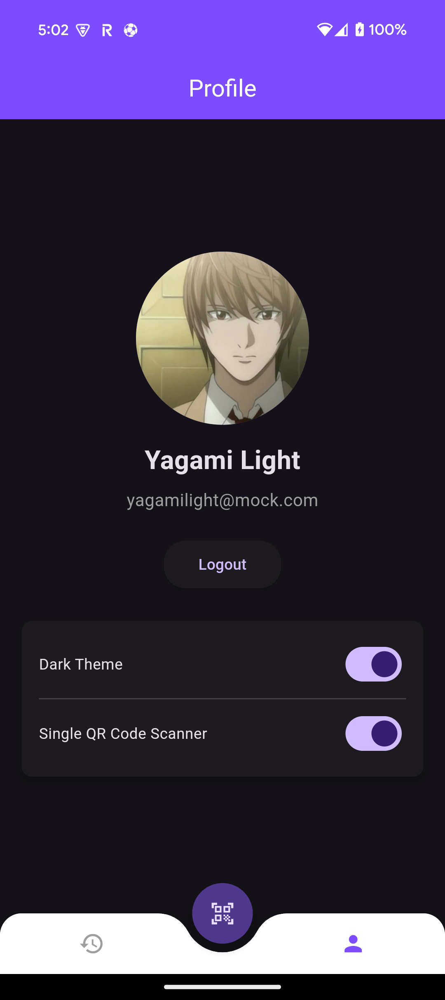

# QR Scanner Workerbase

## Overview

A QR Code Scanner App where users can scan any QR Code and easily see its content, together with a history of all previously scanned QR Codes.

## Features

### Scanner Screen
- **Real-time QR Code Scanning**: The app uses the device's camera to scan QR codes in real-time.
- **Torch and Camera Switch**: Users can toggle the flashlight and switch between front and back cameras.
- **QR Code Detection**: When a QR code is detected, its content is displayed, and users can choose to save it.

#### Screenshots
- Scanning a QR code:
  

    
  

- After successfully scanning a QR code:
  

    
  

### History Screen
- **View Scanned QR Codes**: Users can view a list of all previously scanned QR codes.
- **Filter QR Codes**: Users can filter the list to show specific QR codes.
- **Delete Multiple Items**: Long press on an item to enable multi-select mode and delete multiple items.
- **Detailed View**: Click on an item to view its full content in a dialog, especially useful for long texts.
- **Item content**: Each item displays the content of the QR code, the type of QR code (left icon), and the date and time it was scanned. The share icon allows users to share the content through other apps. The backup icon is not implemented yet.

#### Screenshots
- Empty screen:
  

    
  

- After scanning different types of QR codes:
  

    
  

- Long press to delete multiple items:
  

    
  

- Dialog displaying item details:
  

    
  

### Profile Screen
- **User Profile**: View and edit user profile information. (Not implemented yet)
- **Theme Settings**: Switches allow users to change the theme dark/light.
- **Scanner Settings**: Depending on the user's need, they might want to quit automatically the Scanner screen after every successful QR code scan. Otherwise if the switch is not activated not activated, saving a scanned data won't close the scanner.

#### Screenshots
- Light mode:
  

    
  

- Dark mode:
  

    
  
